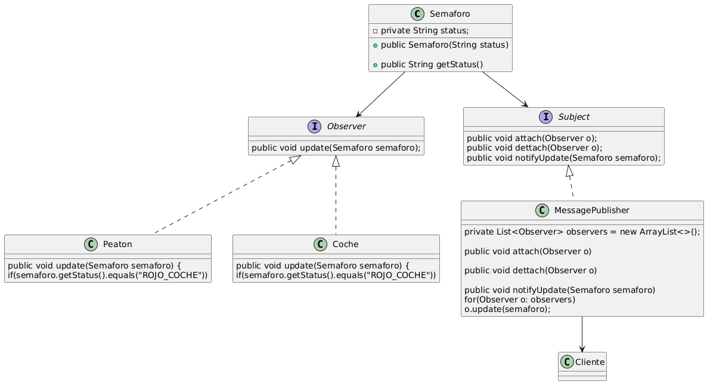

# Observer Patern

Observer es un patrón de diseño de comportamiento que te permite definir un mecanismo de suscripción para notificar a varios objetos sobre cualquier evento que le suceda al objeto que están observando.

En otras palabras, el patron observer y para este ejemplo,
parte de una clase, que es la que queremos observar cuando cambia,
en este caso la clase es semaforo y puntualmente cuando su atributo state 
cambie queremos que actualiza los observadores, para esto tenemos dos 
interfaces que usan la clase obsevada (semaforo), intefaz observer y 
la intefaz subject

* **Observer**: esta interfaz tiene el metodo update, que es la
que todos los interesados, sobreescribirían. para saber que acción 
hacer cuando se actualice la clase observada, esta interfaz la implementarian
las clase observadoras, como es el ejemplo Peaton y Coche, ambos estan 
observando la clase Semafo a traves de la interfa
* **Subject**: es la interfaz encargada de controlar lo que pasa con el observer,
tiene metodos como attach (agregar) desagregar (dattach) y notificar el cambio 
(notify update), la clase que implementa esta interfaz crea una lista de observadores,
y sobre escribe los metodos, para agregar, para remover y también para actualizar los
observadores, mediante el metodo **Update** que tiene cada observador.
**NOTA:** la clase que implemente el subject (MessagePublisher) es la encargada de
interactura con el cliente, para agregar, remover o actualizar la lista de observadores (Peaton, Coche)
que son las clases que implementan la interfaz **Observer**

denote algo bonito, el uso de herencia y de interfaces para hacer esto,
hay una interfaz Observer que es manipulada por la implementacion de la
interfaz Subject, así todo lo que implementan observer pueden ser manipulados
la clase que implementa Subject, y a su vez estas dos interfaces utilizan la
clase observada que es en este caso semafor
# Diagrama

