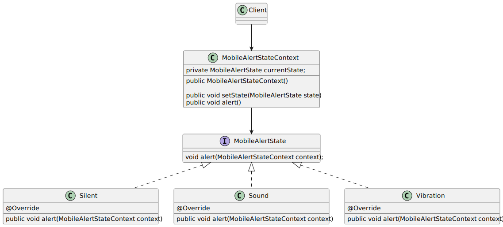

# State Patern

cambiar el comportamiento dependiendo del estado, si bien esto se podría lograr
con if else, con este patrón queda de una formas más ordenada y desacoplada 

tenemos tres partes

* State: es una interfaz que tiene un metodo especifico, en el ejemplo usamos
MobileAlertState que tiene el metodo alert(); 
* ConcreteState: son las clases que implementan la intefaz State y sobrescriben
su metodo con las funcionalidades especifica en el ejemplo son las clase
  * Sound
  * Vibrand
  * Silent
* Context: es una clase que utiliza la interfaz state, recibe como parametro
un state y en el constructor puede recibir un state o tener un state por defecto
teniendo en cuenta que state es una interfaz también puede recibir, cualquiera
de sus hijos. aparte del atributo state y del constructor, tiene el metodo 
setState que permite cambiar el state y un metodo que es el que ejecuta el metodo de la interfaz state. 
en este caso el metodo alert.

**NOTA:** el context es el que se comunica con el cliente, hace las veces de manejador
(handler).

# Diagrama

