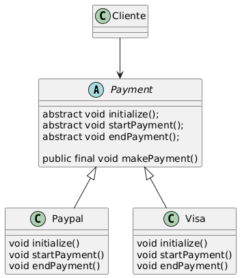

# Template Method

Template Method es un patrón de diseño de comportamiento que define 
el esqueleto de un algoritmo en la superclase pero permite que las
subclases sobrescriban pasos del algoritmo sin cambiar su estructura.

Este patron tiene una clase abstracta (superclase), que define primero los metodos
que se van a ejecutar, como metodos abstractos, luego definie un metodo
publico que ejecuta en orden los metodos, esta clase es extendida por
las clases que requieran la plantilla (template) y cada clase sobre escribe los
metodos de la forma en que los necesit, luego, el cliente crea una
clase de los hijos, y utiliza el metodo que ejecuta en orden los 
metodos

## Diagrama

