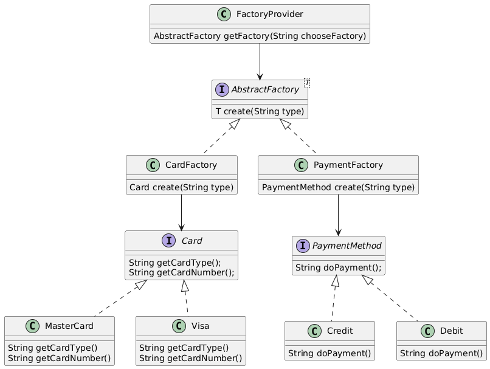

# 🧩 Abstract Factory

## Descripción
Es un patron que permite producir familias de objetos relacionados sin especificar sus clases concretas.

En otras palabras, esté patrón permite crear fabricas de fabricas (Abstract Factory),  este es un abstracción más alta, que permite crear fabricas dependiendo de la necesidad a través del provedor (Factory Provider) que permite seleccionar una fabrica concreta como (Card Factory o Payment Factory),sabemos que la fabrica, es un patron que permite crear objetos que también se conocen como productos (Concrete Product), con su respectiva interfaz, normalmente las fabricas estan relacionadas entre si

## Diagrama


## Estructura
```md
abstractfactory/
├── factory/
│   ├── AbstractFactory.java (interfaz)
│   ├── CardFactory.java (clase)
│   ├── PaymentFactory.java (clase)
│   └── FactoryProvider.java (clase)
│
├── product/
│   ├── card/
│   │   ├── Card.java (interfaz)
│   │   ├── Visa.java (clase)
│   │   └── MasterCard.java (clase)
│   │
│   └── payment/
│       ├── PaymentMethod.java (interfaz)
│       ├── Credit.java (clase)
│       └── Debit.java (clase)
│
└── Main.java
```