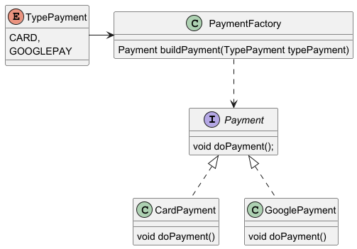

# 🏭 Patrón Factory Method

## 📖 Descripción

El **Factory Method** es un patrón de diseño creacional que proporciona una interfaz para la creación de objetos en una superclase, pero permite que las subclases alteren el tipo de objetos que se crearán.

Se utiliza cuando el código no debe depender de las clases concretas que necesita instanciar, sino de una interfaz o clase abstracta, delegando la creación a un método específico.

###En otras palabras
Este patron permite seleccionar (*Creator*) diferentes objetos (*Concrete*) a partir de una interfaz (*Product*), cada objecto (*Concrete*) personaliza la implementación de la interfaz, lo que permite que cada objeto 


---
## Diagrama



---

## 📂 Estructura del Código

La implementación del **Factory Method** en este proyecto sigue la siguiente estructura de paquetes:

```md
creational/factorymethod
├── product
│   ├── Payment.java (interfaz)
├── concrete
│   ├── CardPyament.java (clase)
│   ├── GooglePyament.java (clase)
├── type
│   ├── TypePayment.java (enum)
├── creator
│   ├── PaymentFactory.java (clase)
```
Otra forma
```md
creational/factorymethod
├── factoryImpl / model
│   ├── Payment.java (interfaz)
│   ├── CardPyament.java (clase)
│   ├── GooglePyament.java (clase)
├── factory
│   ├── PaymentFactory.java (clase)
│   ├── TypePayment.java (enum)
```